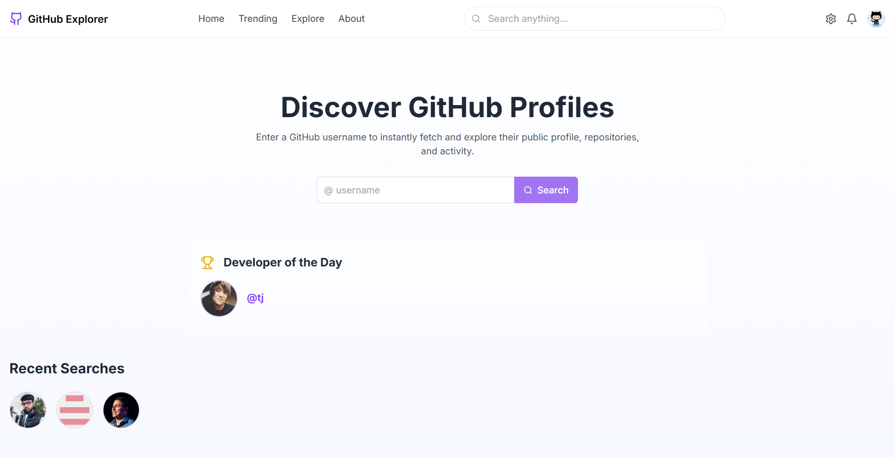

# GitHub Explorer 🚀

A beautiful and interactive web application for exploring GitHub profiles with real-time analytics, contribution tracking, and AI-powered insights. Built with React, TypeScript, and Tailwind CSS.

<div align="center">
  
</div>

## ✨ Features

### Core Features
- 🔍 **Real-time GitHub Profile Search**
  - Instant profile loading
  - Comprehensive user statistics
  - Recent searches history

- 📊 **Advanced Analytics**
  - Interactive contribution calendar
  - Technology distribution charts
  - Repository statistics

- 🎯 **Achievement Tracking**
  - Personal GitHub goals
  - Progress visualization
  - Milestone celebrations

### Special Features
- 🤖 **AI-Powered Insights**
  - Smart profile analysis
  - Development style detection
  - Personalized recommendations

- 🎨 **Dynamic Themes**
  - Default Theme 💡
  - Halloween Mode 🎃
  - Hacker Theme 🕶️
  - Retro Style 👾
  - Matrix Green ☠️

- 👨‍💻 **Developer Spotlight**
  - Featured developer of the day
  - Inspiring success stories
  - Community highlights

## 🛠️ Tech Stack

- **Frontend Framework**: React with TypeScript
- **Styling**: Tailwind CSS
- **Charts**: Chart.js with react-chartjs-2
- **Icons**: Lucide React
- **Animations**: React Spring
- **Data Visualization**: React GitHub Calendar
- **HTTP Client**: Axios
- **Build Tool**: Vite

## 🚀 Getting Started

1. **Clone the repository**
   ```bash
   git clone https://github.com/Saoud30/github-explorer.git
   cd github-explorer
   ```

2. **Install dependencies**
   ```bash
   npm install
   ```

3. **Set up environment variables**
   Create a `.env` file in the root directory:
   ```env
   VITE_GEMINI_API_KEY=your_gemini_api_key
   ```

4. **Start the development server**
   ```bash
   npm run dev
   ```

## 🎨 Theme Showcase

### Default Theme 💡
Clean and modern interface with purple accents

### Halloween Mode 🎃
Spooky orange and dark theme for October vibes

### Hacker Theme 🕶️
Matrix-inspired green on black aesthetic

### Retro Style 👾
Nostalgic design with pixelated elements

### Matrix Green ☠️
Classic terminal look with neon green highlights

## 📱 Responsive Design

GitHub Explorer is fully responsive and works seamlessly across:
- 💻 Desktop computers
- 💪 Tablets
- 📱 Mobile devices

## 🤝 Contributing

Contributions are welcome! Please feel free to submit a Pull Request. For major changes, please open an issue first to discuss what you would like to change.

1. Fork the repository
2. Create your feature branch (`git checkout -b feature/AmazingFeature`)
3. Commit your changes (`git commit -m 'Add some AmazingFeature'`)
4. Push to the branch (`git push origin feature/AmazingFeature`)
5. Open a Pull Request

## 📄 License

This project is licensed under the MIT License - see the [LICENSE](LICENSE) file for details.

## 🙏 Acknowledgments

- Icons by [Lucide React](https://lucide.dev)
- GitHub API for providing the data
- React and the entire open-source community

---

⭐ Star this repository if you find it helpful!
